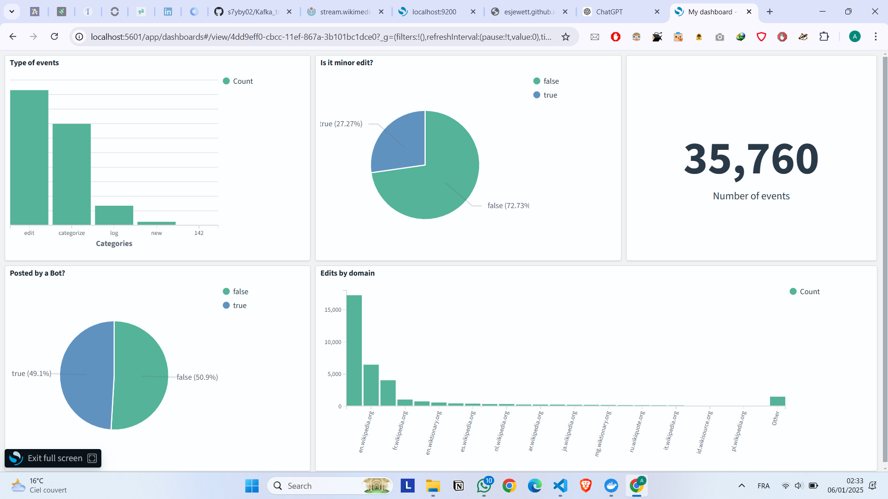

# Wikimedia Stream to OpenSearch with Kafka


## Overview

This project demonstrates a simple pipeline for streaming real-time data from Wikimedia's EventStream API to OpenSearch using Apache Kafka. The pipeline consists of two components:

1. **Kafka Producer**: Streams data from Wikimedia's recent change feed and sends it to a Kafka topic.
2. **Kafka Consumer**: Reads data from the Kafka topic and indexes it into OpenSearch.

The system is containerized using Docker and orchestrated with `docker-compose`.


---
## Output OpenSearch Dashboards


## Directory Structure

```
Kafka_to_OpenSearch/
├── README.md               # Project documentation
├── docker-compose.yml      # Docker Compose configuration file
├── kafkaConsumer.py        # Kafka Consumer script
└── kafkaProducer.py        # Kafka Producer script
└── requirements.txt        # Python requirements for the project
```

---

## Prerequisites

1. **Docker**: Ensure Docker is installed on your system.
2. **Docker Compose**: Install Docker Compose to manage multi-container applications.
3. **Python 3.x**: Required for running the producer and consumer scripts.
4. **Virtual Environment**: Create and activate a Python virtual environment (optional):
    ```bash
   python -m venv venv
   source venv/bin/activate 
   ```

5. **Dependencies**: Install Python dependencies with:
   ```bash
   pip install -r requirements.txt
   ```

---

## Getting Started

### Step 1: Start the Services

Run the following command to start all services:

```bash
docker-compose up
```

This will launch the following services:

- **Zookeeper**: Manages Kafka broker coordination.
- **Kafka**: Message broker for the producer and consumer.
- **OpenSearch**: Stores and indexes the streamed data.
- **OpenSearch Dashboards**: Web interface for visualizing OpenSearch data.

### Step 2: Run the Kafka Producer

In a separate terminal, start the producer script:

```bash
python kafkaProducer.py
```

This script connects to Wikimedia's EventStream API and sends real-time data to the Kafka topic `wikimedia`.

### Step 3: Run the Kafka Consumer

In another terminal, start the consumer script:

```bash
python kafkaConsumer.py
```

The consumer reads data from the Kafka topic and indexes it into the OpenSearch index `wikimedia`.

---

## Configuration

### Kafka Configuration

- **Kafka Topic**: `wikimedia`
- **Kafka Server**: `localhost:9092`

### OpenSearch Configuration

- **Host**: `localhost:9200`
- **Index Name**: `wikimedia`
- **Authentication**:
  - Username: `admin`
  - Password: `sdlSDFqkjgsd6842sdgkjsqdg+dfs:`

> **Note**: Update these settings in the Python scripts if necessary.

---

## Visualization with OpenSearch Dashboards

1. Open your browser and navigate to [http://localhost:5601](http://localhost:5601).
2. Log in using the default credentials:
   - Username: `admin`
   - Password: `sdlSDFqkjgsd6842sdgkjsqdg+dfs:`
3. Create an index pattern for `wikimedia` to visualize the data.


